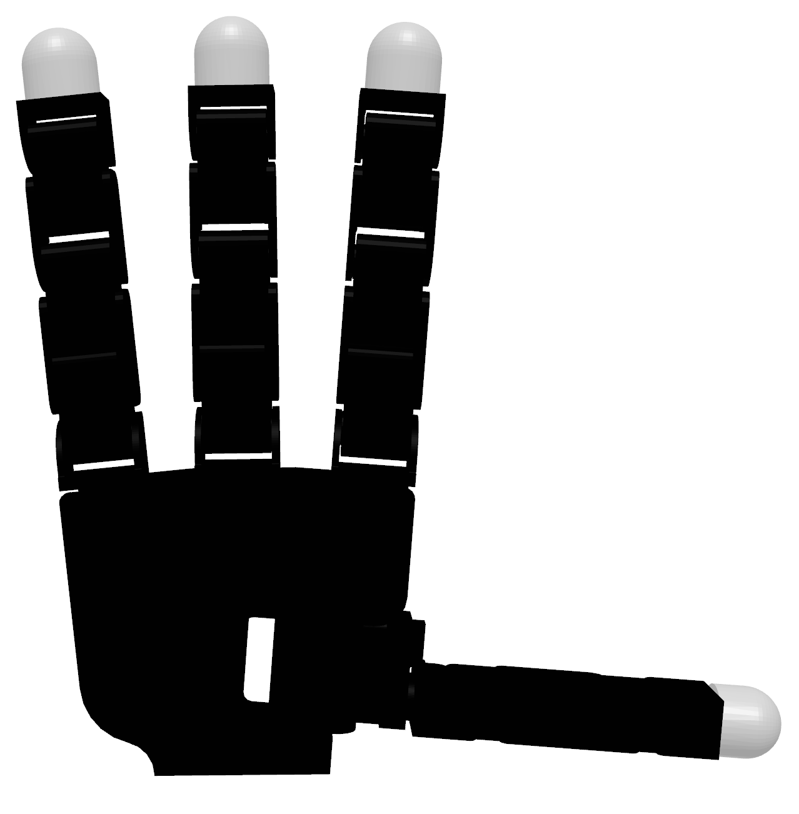
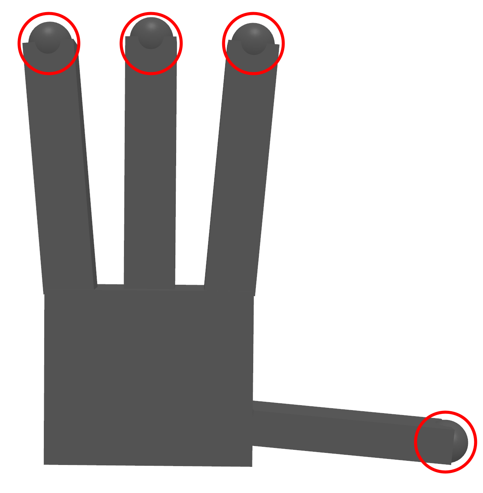
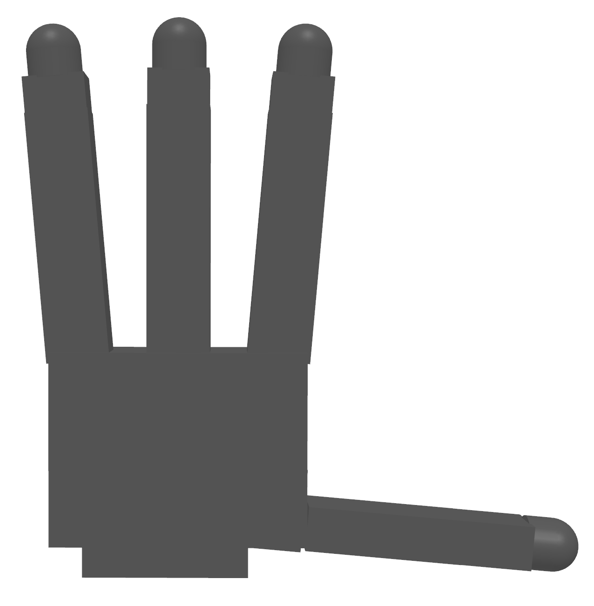

This repository offers an assortment of high-quality models for dexterous hands and objects. Both of them are in URDF
format.

|  Robot Model  |                                               Visual[^1]                                               | Collision[^2] | 
|:-------------:|:------------------------------------------------------------------------------------------------------:|:-------------:|
| Allegro Hand  |  |       0       |
|  Shadow Hand  |     |       0       |
| Ability Hand  |  |       0       |
| DClaw Gripper |        |       0       |
| Barrett Hand  |           |       0       |

[^1]: Ray tracing animation are rendered in `SAPIEN` using the urdf with `glb` version. Code can be found in [SAPIEN ]()
[^2]: Rasterization images are rendered in `IsaacGym` using the with the `glb` version
following platform: [yourdfpy](https://github.com/clemense/yourdfpy),
[IsaacGym](https://developer.nvidia.com/isaac-gym),
[SAPIEN](https://sapien.ucsd.edu/),
[PyBullet](https://pybullet.org/wordpress/)

## Why do we need this repo?

The robot models in this repo are different from the original robot description files provided by the robot driver
package in serval aspects:

Improved collision mesh

 
  All collision mesh are represented as stl or URDF primitives with simplified triangle meshes, i.e. fewer vertices and
  simpler edge connection. No self collision after loading into simulator.

|          Allegro Visual Model          |              Original Collision Model              |           Improved Collision Model            |
|:--------------------------------------:|:--------------------------------------------------:|:---------------------------------------------:|
|  |  |  | 

Improved visual mesh

Consistent mesh format. All visual mesh are stored as `.obj` but not `.dae`,
since different DAE loader may treat DAE differently, resulting inconsistent behavior across different URDF parser.
For enhanced support of physically based rendering,
every URDF file in this repository is accompanied by a GLTF version of urdf,
which contains meshes in glb format, in addition to a standard urdf with obj mesh.
Many simulators, such as IsaacGym and SAPIEN, can utilize the glb version to achieve superior visual results.

More stable inertia parameters

Consistent URDF parsing across different parsers, e.g. different simulator

Consistent root convention and auxiliary links

For all dexterous hands, the orientation are kept consistent across all dexterous hands. For right hand, the x-axis is
forward, the y-axis the direction from litter finger to thumb, the z-axis is the direction from wrist to fingertip of
middle finger.

## Robot Source

|   Robot Model   |                          Official Website                           |                                                 URDF Source                                                 |                                    CAD Model Source                                    |  License   |
|:---------------:|:-------------------------------------------------------------------:|:-----------------------------------------------------------------------------------------------------------:|:--------------------------------------------------------------------------------------:|:----------:|
|  Allegro Hand   | [Wonik Robotics](https://www.wonikrobotics.com/research-robot-hand) | [allegro_hand_ros](https://github.com/simlabrobotics/allegro_hand_ros/tree/master/allegro_hand_description) |                                          N/A                                           |    BSD     |
| SCHUNK SVH Hand |                 [SCHUNK](https://schunk.com/us/en)                  |             [schunk_svh_ros_driver](https://github.com/SCHUNK-GmbH-Co-KG/schunk_svh_ros_driver)             |                                          N/A                                           | Apache-2.0 |
|   Shadow Hand   |        [Shadow Robot Company](https://www.shadowrobot.com/)         |                     [schunk_svh_ros_driver](https://github.com/shadow-robot/sr_common)                      |                                          N/A                                           |  GPL-3.0   |
|   Robel DClaw   |     [Robel Benchmark](https://github.com/google-research/robel)     |                                                     N/A                                                     | [D'Claw CAD](https://drive.google.com/drive/folders/1H1xN5BU03-eXjuEyIL_iJ_4XzrdDSnlM) | Apache-2.0 |
|  Barrett Hand   |  [Barrett Technology](http://barrett.com/robot/products-hand.html)  |                        [bhand_model](https://github.com/jhu-lcsr-attic/bhand_model)                         |    [BarrettHand CAD](https://github.com/jhu-lcsr-attic/bhand_model/tree/master/cad)    |    BSD     |
|  Ability Hand   |                 [PSYONIC](https://www.psyonic.io/)                  |                     [ability-hand-api](https://github.com/psyonicinc/ability-hand-api)                      |                                          N/A                                           |    N/A     |

## Todo

- [ ] Attach hand on robot arm
- [ ] Manipulated objects for dexterous hands
- [ ] Add Barrett Hand
- [ ] PyBullet URDF checking
- [X] SAPIEN URDF checking
- [X] IsaacGym URDF checking
- [X] Self collision checking
